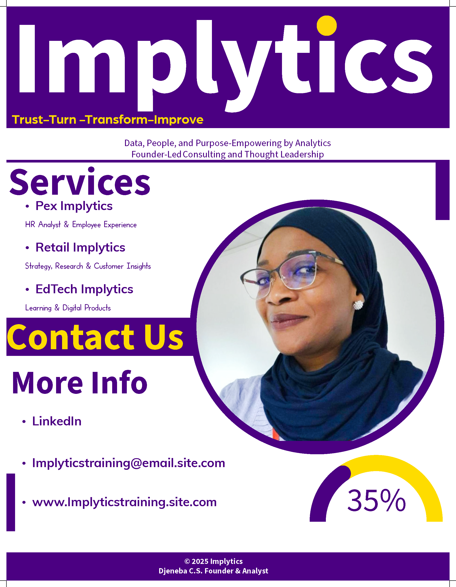

  

  

# 💼 Implytics R Projects

### Data · People · Purpose — Empowered by Analytics

**Founder:** D. C. Sylla  
**Role:** Founder & Analyst  
**Brand Focus:** Founder-led thought leadership and strategic consulting under the Implytics ecosystem.

---

## 🌍 About the Implytics Ecosystem

Implytics is a **founder-led, human-centered analytics brand** built around data-driven insight and social impact.

It unites multiple practice areas:

| Sub-Brand | Focus | Core Offerings |
|------------|--------|----------------|
| **Pex Implytics** | HR Analytics & Employee Experience | People dashboards, recruitment funnel, ER health checks |
| **Retail Implytics** | Strategy & Customer Insights | RFM segmentation, loyalty analysis, retail dashboards |
| **EdTech Implytics** | Learning & Digital Products | Mini-courses, templates, playbooks for professionals |

---

## ✨ Featured Sections

| File | Description |
|------|--------------|
| [📄 COVER.md](./COVER.md) | Official Implytics brand cover page with header design |
| [🌱 SOCIAL_IMPACT.md](./SOCIAL_IMPACT.md) | “Our Wellbeing, Our Future (OWOF)” — social responsibility initiative |

---

## 🤝 Connect

  <a href="https://github.com/Implyticsrprojects25">GitHub</a> · 
  <a href="https://www.linkedin.com/in/Djeneba. C.S.">LinkedIn</a> · 
  <a href="mailto:Implyticsrprojects25@users.noreply.github.com">Contact</a>

  

<strong>© 2025 Implytics R Projects | Djeneba. C.S./strong>

Implytics-R-Projects/
│
├── COVER.md
├── SOCIAL_IMPACT.md
├── README.md
│
└── assets/
    └── implytics_cover.png     ← (your purple + yellow portrait header image)
# Implytics R Projects

Welcome to the **Implytics Portfolio Repository**, showcasing the brand identity, social responsibility vision, and ecosystem of founder-led analytics initiatives.

---

## 🪶 Contents
- [Cover Page](./COVER.md)
- [Social Responsibility — OWOF](./SOCIAL_IMPACT.md)

---

**Founder:** D. C. Sylla  
**Implytics® — Data, People, and Purpose.**
